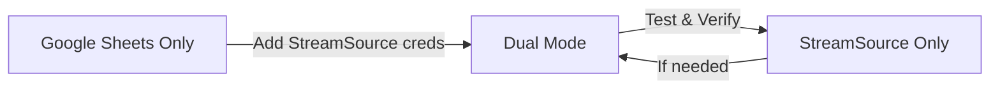

# Backend Quick Reference

## Which Backend Should I Use?

### Use Google Sheets if you:
- ✅ Want the simplest setup
- ✅ Need ignore lists (block specific users/URLs)
- ✅ Want location parsing (city/state detection)
- ✅ Prefer a visual spreadsheet interface
- ✅ Don't need API-level features
- ✅ Want free hosting (Google Sheets is free)

### Use StreamSource if you:
- ✅ Need a proper REST API
- ✅ Want programmatic access to your data
- ✅ Plan to build additional integrations
- ✅ Need advanced stream management features
- ⚠️ Don't need ignore lists (not yet supported)
- ⚠️ Don't need location parsing (not yet supported)

### Use Both (Dual Mode) if you:
- ✅ Want API access AND spreadsheet interface
- ✅ Need ignore lists with API backend
- ✅ Are testing StreamSource before switching
- ✅ Want redundancy/backup
- ⚠️ Can accept slightly slower performance

## Quick Setup Commands

### Google Sheets Only
```bash
# In your .env file, just add:
GOOGLE_SHEET_ID=your_sheet_id
GOOGLE_CREDENTIALS_PATH=./credentials.json

# That's it! Other defaults will work
```

### StreamSource Only
```bash
# In your .env file:
BACKEND_MODE=single
BACKEND_PRIMARY=streamSource
BACKEND_GOOGLE_SHEETS_ENABLED=false
BACKEND_STREAMSOURCE_ENABLED=true
STREAMSOURCE_EMAIL=your@email.com
STREAMSOURCE_PASSWORD=your_password
GOOGLE_SHEET_ID=placeholder
```

### Both Backends
```bash
# In your .env file:
BACKEND_MODE=dual-write
BACKEND_GOOGLE_SHEETS_ENABLED=true
BACKEND_STREAMSOURCE_ENABLED=true
# Plus both Google and StreamSource credentials
```

## Feature Comparison

| Feature | Google Sheets | StreamSource | Both |
|---------|--------------|--------------|------|
| Stream Storage | ✅ | ✅ | ✅ |
| Deduplication | ✅ | ✅ | ✅ |
| Ignore Lists | ✅ | ❌ | ✅* |
| Location Parsing | ✅ | ❌ | ✅* |
| Visual Interface | ✅ | ❌ | ✅ |
| REST API | ❌ | ✅ | ✅ |
| Free Hosting | ✅ | ❓ | ❓ |
| Rate Limits | Generous | 1000/min | Both |
| Authentication | Service Account | JWT (24hr) | Both |
| Bulk Export | ✅ | 🔒** | ✅ |

\* When using both, these features come from Google Sheets  
\** Requires feature flag in StreamSource

## Migration Path



1. Start with Google Sheets (easiest)
2. Add StreamSource in dual mode
3. Test everything works
4. Switch primary to StreamSource
5. Optionally disable Google Sheets

## Common Configurations

### Personal Project
```bash
BACKEND_MODE=single
BACKEND_PRIMARY=googleSheets
# Simple, free, full features
```

### API Integration Project
```bash
BACKEND_MODE=dual-write
BACKEND_PRIMARY=streamSource
# API access with Google Sheets for missing features
```

### High-Volume Monitoring
```bash
BACKEND_MODE=single
BACKEND_PRIMARY=streamSource
# Better performance, proper API rate limits
```

### Testing/Development
```bash
BACKEND_MODE=dual-write
# Write to both, compare results
```

## Decision Tree

```
Do you need ignore lists?
├─ Yes → Do you need API access?
│        ├─ Yes → Use Both (Dual Mode)
│        └─ No → Use Google Sheets
└─ No → Do you need API access?
         ├─ Yes → Use StreamSource
         └─ No → Use Google Sheets (simpler)
```

## Environment Variable Reference

### Minimal Google Sheets
```bash
GOOGLE_SHEET_ID=xxx
GOOGLE_CREDENTIALS_PATH=./credentials.json
```

### Minimal StreamSource
```bash
BACKEND_PRIMARY=streamSource
BACKEND_GOOGLE_SHEETS_ENABLED=false
BACKEND_STREAMSOURCE_ENABLED=true
STREAMSOURCE_EMAIL=xxx
STREAMSOURCE_PASSWORD=xxx
GOOGLE_SHEET_ID=placeholder
```

### Full Dual Mode
```bash
BACKEND_MODE=dual-write
BACKEND_PRIMARY=googleSheets
BACKEND_GOOGLE_SHEETS_ENABLED=true
BACKEND_STREAMSOURCE_ENABLED=true
GOOGLE_SHEET_ID=xxx
GOOGLE_CREDENTIALS_PATH=./credentials.json
STREAMSOURCE_EMAIL=xxx
STREAMSOURCE_PASSWORD=xxx
```